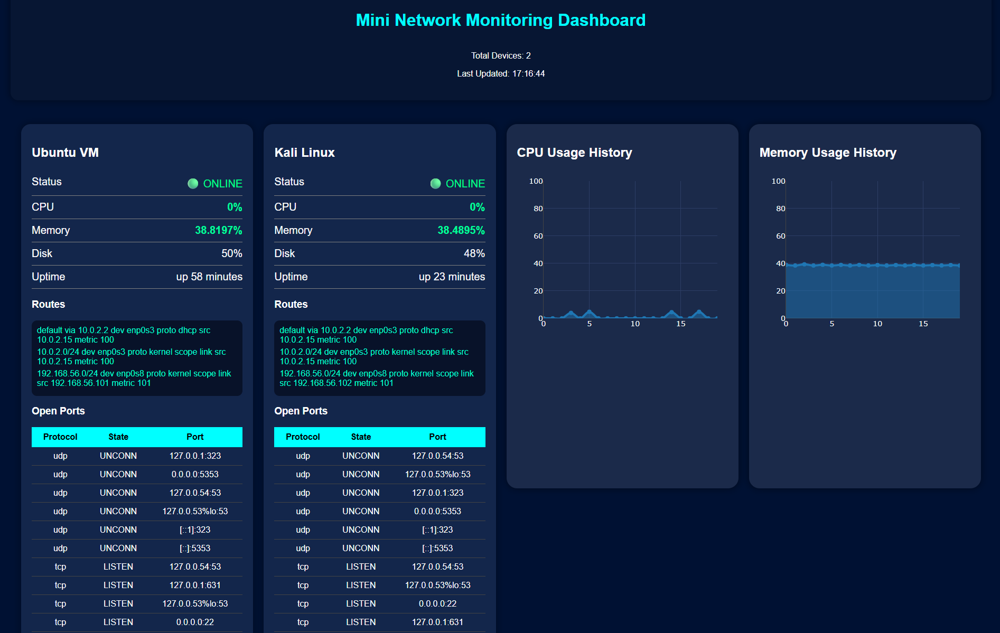

# Mini NMS - Network Monitoring Dashboard

A lightweight Network Monitoring System (Mini NMS) built using Python, Flask, Paramiko, HTML/CSS, and Plotly for monitoring Linux devices over SSH.

---

## Features

- Multi-device monitoring
- Real-time CPU monitoring
- Memory usage monitoring
- Disk utilization monitoring
- Device uptime tracking
- Route table monitoring
- Open ports monitoring
- Device ONLINE/OFFLINE detection
- Real-time graphs using Plotly
- Responsive dashboard UI

---

## Technologies Used

- Python
- Flask
- Paramiko
- HTML/CSS
- Plotly
- Linux
- SSH
- VirtualBox

---

## Project Architecture

```text
Linux Devices --> SSH --> Python Collector --> Flask Backend --> Dashboard UI
```

---

## Dashboard Preview



---

## Installation

### Clone Repository

```bash
git clone https://github.com/YOUR_USERNAME/mini-nms.git
```

### Enter Project

```bash
cd mini-nms
```

### Install Dependencies

```bash
pip install -r requirements.txt
```

### Run Application

```bash
python app.py
```

---

## Device Configuration

Edit:

```text
devices.json
```

Example:

```json
{
  "devices": [
    {
      "name": "Ubuntu VM",
      "host": "192.168.56.101",
      "port": 22,
      "username": "rana-roy",
      "password": "password"
    }
  ]
}
```

---

## Future Enhancements

- SNMP Monitoring
- Email Alerts
- Telegram Alerts
- Database Integration
- Grafana Integration
- Docker Deployment
- Authentication System
- Real-time AJAX Updates

---

